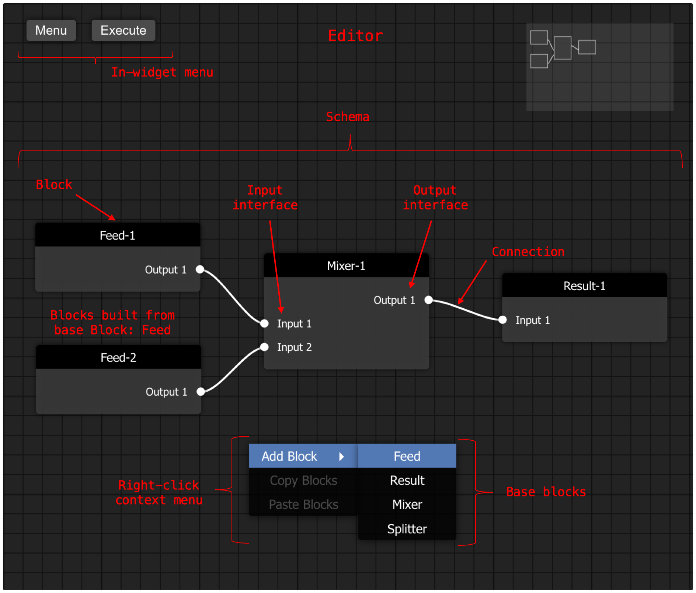

# Introduction

Barfi is a Flow Based Programming environment that provides a graphical programming interface. It is integratable into your existing Python workflows. A schema is built using `barfi.Block`s. Then the schema is executed with `barfi.ComputeEngine`.

Each `barfi.Block` has some properties that enable the FBP and schema building. Firstly, each Block has Input and Output interfaces that link to other Blocks. Each Block can carry an executable function, that is specified by the user. This function can access/get data from the Input interface, perform computations or calculations and set the Output interface. 

In general, Barfi is an abstraction of the Graphical Programming, Flow Based Programming or Node programming. Where the Block is synonymous to Node, and a Link (connection) is synonymous to an Edge. There are many ways to call this, each serving a specific need or a philosophy. For, Barfi I've kept it simple, so that it can be customized to different use-cases and philosophy. 

Existing visual Flow Based Programming (FBP) libraries in Python run in their own/separate environment. They are not integratable into existing workflows, nor can they be used as a component in your existing scripts. Barfi bridges this with a Streamlit widget, and a Jupyter-Notebook widget is in the roadmap. 

The other main limitation for the existing Python libraries is the lack of domain specific components. Barfi has a roadmap to add domain specific components.

## Reference terms

### Block

A `barfi.Block` forms the fundamental part of the FBP. `base_blocks` make up the resuable Blocks that are used to build the schema.

### Schema 

A schema is the representation of the flow program that is built using the `base_blocks`, and the Blocks are connected with each other. The entire representation of this is called the schema.

### Connection

The connection here is the connection or link between two Blocks in the built schema. 

### Editor

The editor is the visual interface where the Blocks are added, connections are made and the schema is built. The editor also has a minimap to visualise the map of the schema wth respect to the interface area. The editor also has a **Menu** button and **Execute** 
button.

### Execute 

Upon pressing the execute button in the editor, the built schema is return along with the executed Blocks (if `compute_engine=True`).

