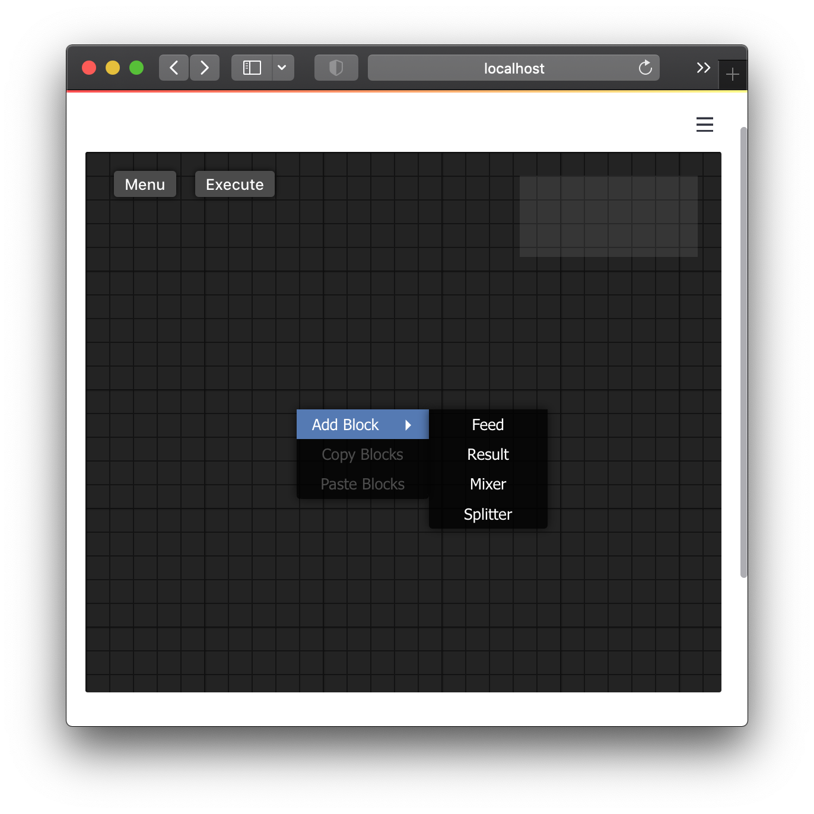
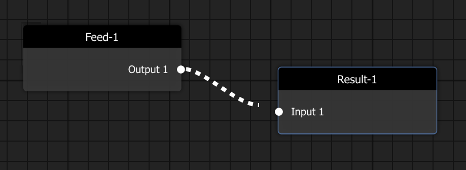
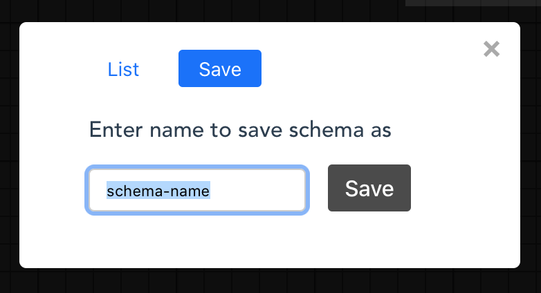

Streamlit Widget
================

The graphical interface for building the schema for the FBP. Using the component `st_barfi` provided with `barfi`, the API to the client can be accessed. Running the streamlit app, serves the `barfi` GUI in the frontend as shown below.

The component interface is called the *Editor* within the context of Barfi. Right clicking on the *Editor*, opens the context menu from which *Blocks* can be added to the *Editor*. And connections can be made between each *Block*.

Within the **Menu** in the *Editor*, the drawn schema can be saved and loaded. It has to be given a unique name. The saved schema name can be loaded passing the name of the schema as the `load_schema` argument to the widget.

API Reference
-------------

``barfi.st_barfi(base_blocks, compute_engine=False, load_schema=None)``
^^^^^^^^^^^^^^^^^^^^^^^^^^^^^^^^^^^^^^^^^^^^^^^^^^^^^^^^^^^^^^^^^^^^^^^

.. list-table::
   :width: 100%
   :widths: 25 75
   :header-rows: 0

   * - **Parameters**
     - **base_blocks** : *List of barfi.Block, Dict*
   * - 
     - A list of the base *barfi.Block* s built using the barfi.Block class. Or, a Dictionary (key, value pairs) with key refereing to categories (which will be used in the submenu in the frontend/client) and value with the list of barfi.Blocks. Refer to the *barfi.Block* here, :doc:`block`.
   * - 
     - **compute_engine** : *bool, default False*
   * - 
     - A *bool* to activate the `compute_engine`. On ``True``, evaluates each *Block* by running the compute function added to it. More detail of the compute engine can be found here, :doc:`compute-engine`.
   * - 
     - **load_schema** : *str, default None*
   * - 
     - The *schema* of the flow program can be saved within the 
   * - **Returns**
     - **dict**
   * - 
     - A dict returning the created and evaluated schema from the frontend/client. Information of each *Block* with its connections and value is referenced by the name of the *Block*

**Example**

.. code-block:: python
  :linenos:

  from barfi import st_barfi, Block

  add = Block(name='Addition') 
  sub = Block(name='Subtraction')
  mul = Block(name='Multiplication')
  div = Block(name='Division')

  barfi_result = st_barfi(base_blocks= [add, sub, mul, div])
  # or if you want to use a category to organise them in the frontend sub-menu
  barfi_result = st_barfi(base_blocks= {'Op 1': [add, sub], 'Op 2': [mul, div]})

